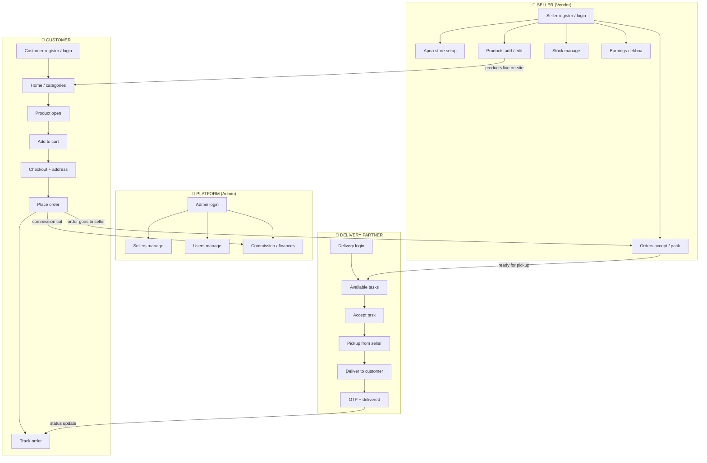
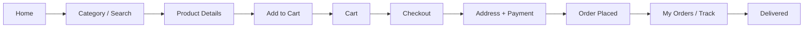
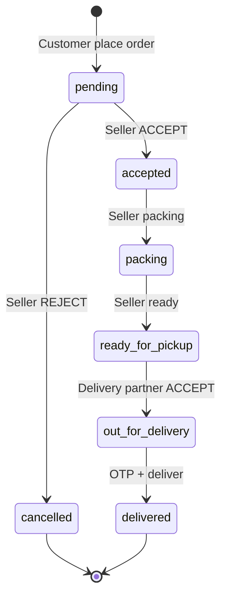
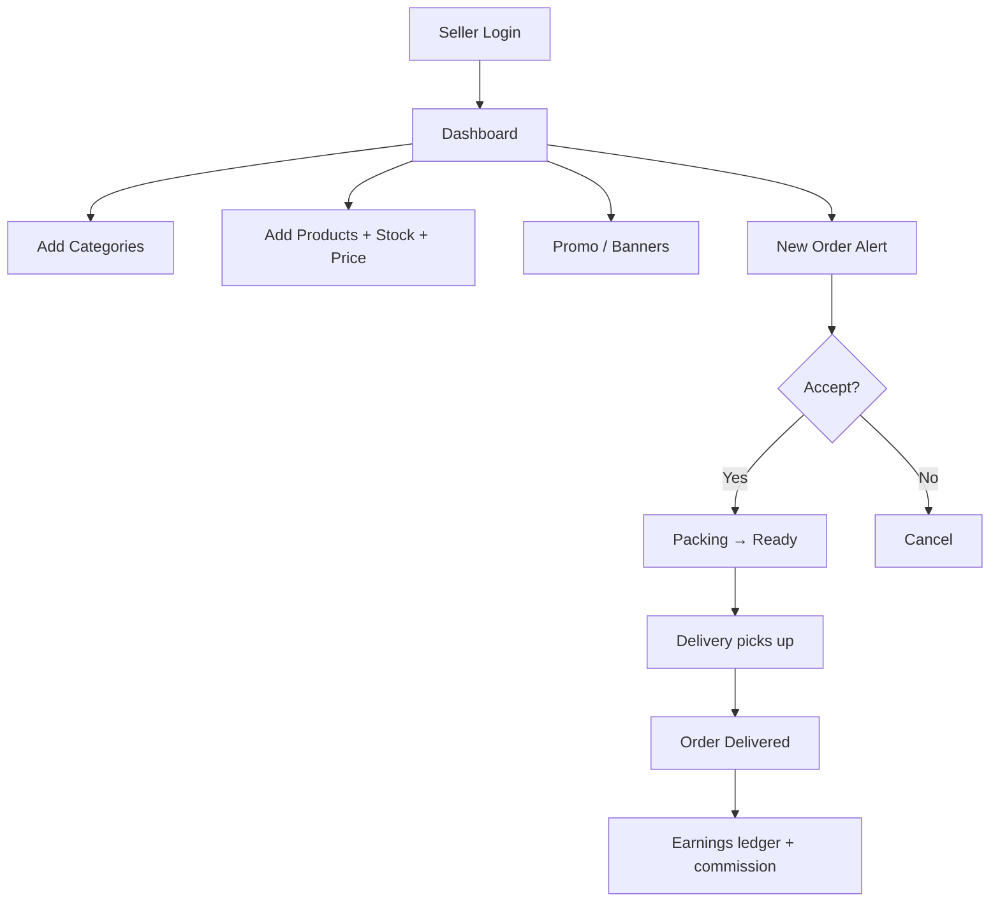
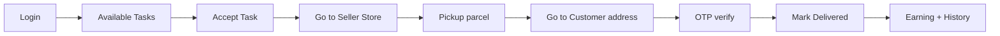
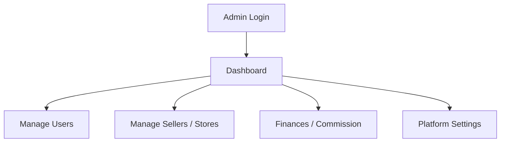
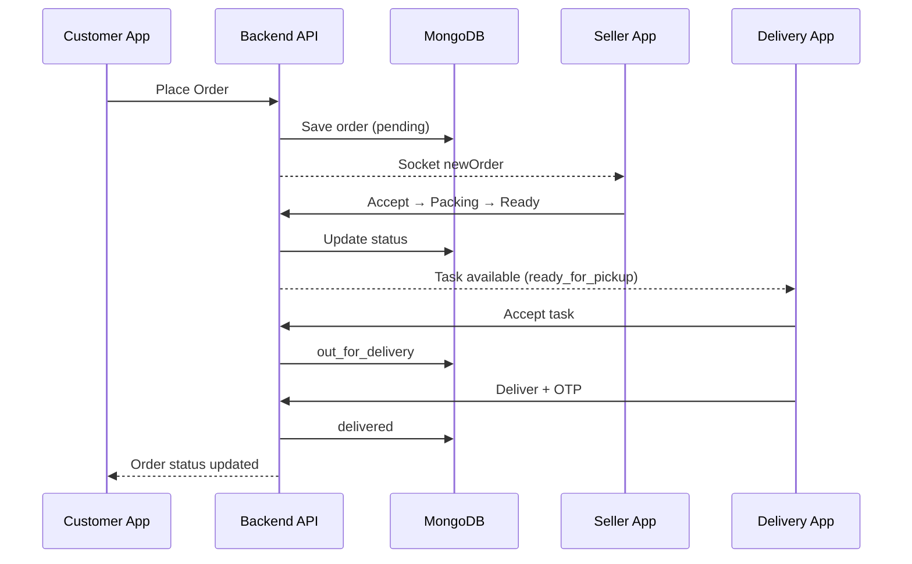

# E-Commerce Store — Flipkart Jaisa Project Flow

> **Important:** Ye ek **single shop** nahi hai.  
> Ye **Flipkart / Amazon jaisa multi-seller marketplace** hai.

---

## 1. Simple Idea (1 minute mein samjho)

| Flipkart | Is project mein |
|----------|-----------------|
| Flipkart platform | **Admin** control karta hai |
| Seller (jo products bechta hai) | **Vendor** (+ unka Seller Store) |
| Buyer (jo kharidta hai) | **Customer** |
| Delivery partner | **Delivery Boy** |
| Product catalogue | **Products** (har seller ke apne) |
| Order tracking | **Order status timeline** |

**Asli meaning of "Shop" in code:**  
Code mein `Shop` model = seller ka **store / brand** (jaise Flipkart pe "Seller: ABC Electronics").  
Ye local kirana shop app nahi hai.

---

## 2. 4 Roles — Kaun kya karta hai

```text
┌─────────────────────────────────────────────────────────────┐
│                    MARKETPLACE PLATFORM                      │
│                         (Admin)                              │
│   Users · Sellers approve · Commission · Settings            │
└──────────────┬──────────────────┬──────────────┬────────────┘
               │                  │              │
       ┌───────▼───────┐  ┌───────▼──────┐  ┌───▼──────────┐
       │   CUSTOMER    │  │    SELLER    │  │   DELIVERY   │
       │  (Buyer app)  │  │  (Vendor)    │  │   PARTNER    │
       │               │  │              │  │              │
       │ Browse        │  │ Add products │  │ Pickup order │
       │ Cart          │  │ Manage stock │  │ Deliver      │
       │ Checkout      │  │ Accept order │  │ OTP confirm  │
       │ Track order   │  │ Pack & ready │  │ Earn fee     │
       │ Wishlist      │  │ See earnings │  │              │
       └───────────────┘  └──────────────┘  └──────────────┘
```

### Role routes (frontend)

| Role | Login ke baad URL | Portal |
|------|-------------------|--------|
| Customer | `/` | Home, products, cart, orders |
| Seller (Vendor) | `/vendor` | Dashboard, products, orders, earnings |
| Delivery | `/delivery` | Tasks, history, earnings |
| Admin | `/admin` | Users, sellers, finances |

---

## 3. Big Picture Flowchart (Flipkart style)



---

## 4. Customer Journey (jaise Flipkart app)



### Customer screens (product-first — Flipkart style)

1. **Home** (`/`) — banners, categories, featured products, deals  
2. **All Products** (`/products`) — full catalogue + search  
3. **Category** (`/category/:key`) — Electronics, Clothing, etc.  
4. **Product** (`/product/:id`) — price, discount, reviews, **Sold by Seller** (text only)  
5. **Cart** (`/cart`) — quantity change, total  
6. **Checkout** (`/checkout`) — address, place order  
7. **Orders** (`/orders`) — status timeline (Placed → Packing → Out → Delivered)  
8. **Wishlist** (`/wishlist`) — saved products  

> **No separate shop browse.** Customer products dekhta hai.  
> Seller ka naam sirf “Sold by XYZ” dikhta hai — Flipkart jaisa.  
> `/shops` aur `/shop/:id` redirect hote hain `/products` pe.

---

## 5. Order Lifecycle (sabse important flow)

Yahi Flipkart ka core logic hai — **ek order ka pure journey**:



### Step-by-step (Hindi)

| Step | Kaun | Status | Kya hota hai |
|------|------|--------|--------------|
| 1 | Customer | `pending` | Order place. Seller ko real-time alert (Socket.io) |
| 2 | Seller | `accepted` | Seller order accept karta hai |
| 3 | Seller | `packing` | Product pack ho raha hai |
| 4 | Seller | `ready_for_pickup` | Delivery partners ko task dikhta hai |
| 5 | Delivery | `out_for_delivery` | Rider pickup karke customer ke paas jaata hai |
| 6 | Delivery | `delivered` | OTP se confirm, order complete |
| ❌ | Seller | `cancelled` | Reject → order cancel |

### Money split (Flipkart jaisa commission)

```text
Customer pays:     ₹1,000
Platform fee 10%:  ₹100   → Admin / Platform
Seller net:        ₹900   → Vendor earnings
Delivery fee:      ~₹40   → Delivery partner (flat fee in app)
```

---

## 6. Seller (Vendor) Flow



**Seller portal pages:**  
`/vendor` · products · categories · orders · inventory · earnings · banners · settings

---

## 7. Delivery Partner Flow



**Delivery portal pages:**  
`/delivery` · earnings · history · profile

---

## 8. Admin Flow



**Admin portal pages:**  
`/admin` · shops (sellers) · users · finances · settings

---

## 9. Data Model (simple)

```text
User (role = customer | vendor | admin | delivery)
  │
  ├── Vendor → has one Shop (Seller Store)
  │                 │
  │                 ├── Categories
  │                 ├── Products (price, stock, images, reviews)
  │                 └── Orders (for this seller)
  │
  ├── Customer → Cart, Wishlist, Addresses, Orders
  │
  └── Delivery → assigned Orders (deliveryBoyId)

Order
  ├── userId      (customer)
  ├── shopId      (seller store)
  ├── items[]     (products + qty + price)
  ├── totalAmount
  ├── status      (pending → … → delivered)
  ├── deliveryBoyId
  ├── deliveryOTP
  └── timeline[]
```

**Multi-seller cart rule (Flipkart style):**  
Agar cart mein 2 alag sellers ke products hain → backend **2 alag orders** banata hai (har seller ke liye alag).

---

## 10. Tech Flow (request ka raasta)



### Stack

| Layer | Tech |
|-------|------|
| Frontend | React + Vite + React Router |
| Backend | Node.js + Express |
| Database | MongoDB + Mongoose |
| Real-time | Socket.io |
| Auth | JWT + role middleware |

---

## 11. Folder Map (code kahan hai)

```text
E Commerce Store/
├── frontend/src/
│   ├── pages/              → Customer screens
│   ├── pages/vendor/       → Seller portal
│   ├── pages/delivery/     → Delivery portal
│   ├── pages/admin/        → Admin portal
│   ├── contexts/           → Auth, Cart, Socket
│   └── App.jsx             → All routes
│
└── backend/
    ├── models/             → User, Shop, Product, Order, ...
    ├── controllers/        → Business logic
    ├── routes/             → API endpoints
    └── server.js           → App + Socket.io
```

---

## 12. Confusion clear — Shop vs Marketplace

| Galat soch | Sahi soch (Flipkart) |
|------------|----------------------|
| Ek shop, ek owner | Kai sellers, ek platform |
| Customer sirf ek shop se kharide | Customer kai sellers se ek cart mein |
| "Shop online/offline" = kirana | Seller store active/inactive |
| Local delivery only app | Full marketplace: buy → sell → deliver → admin |

**Short line:**  
> **Admin = Flipkart company · Vendor = Seller · Shop = Seller ka store · Customer = Buyer · Delivery = Rider**

---

## 13. Quick test path (end-to-end)

1. **Admin** se seller approve / users check  
2. **Seller** login → product add (stock + price)  
3. **Customer** login → product cart → checkout → order place  
4. **Seller** → Accept → Packing → Ready for pickup  
5. **Delivery** → Accept task → Deliver (OTP)  
6. **Customer** → Orders pe "Delivered" dikhe  
7. **Seller** → Earnings mein net amount  
8. **Admin** → Finances mein commission  

---

*Ye document project ka master flow chart hai. Code change ke bina sirf samajhne ke liye.*
